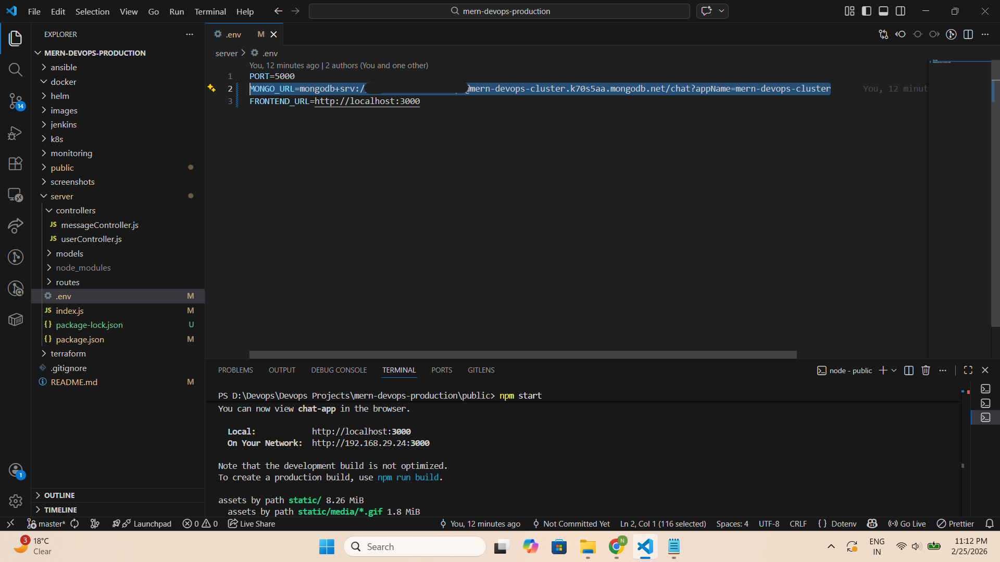
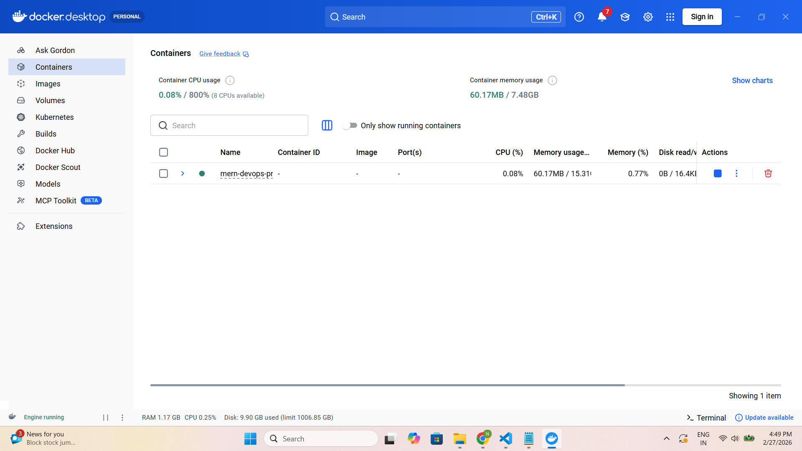
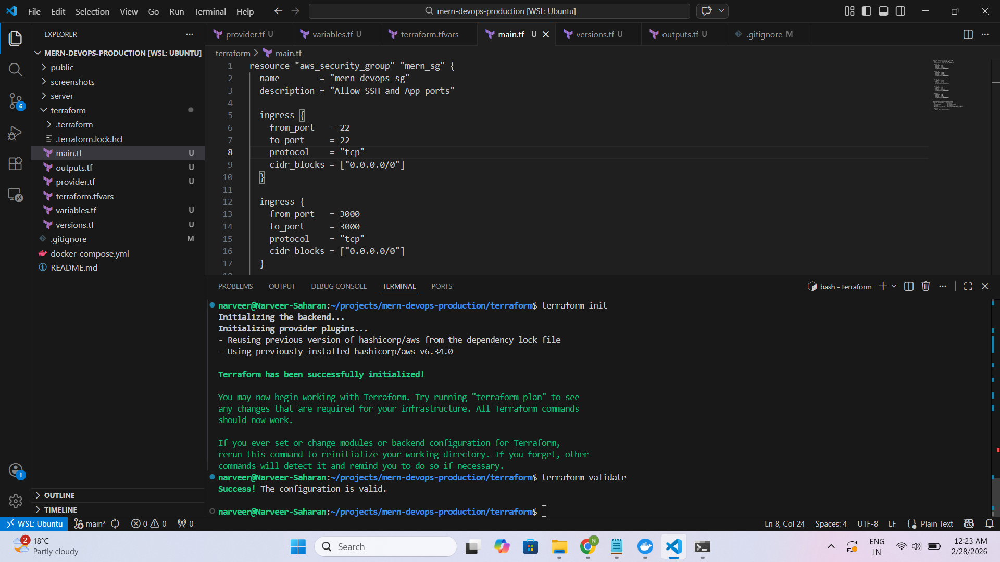
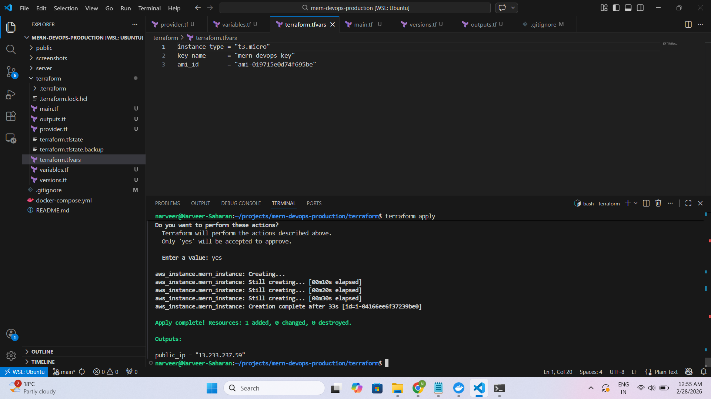

# 🚀 Production-Ready MERN DevOps Project

A production-oriented MERN (MongoDB, Express, React, Node.js) chat application built and deployed using real-world DevOps practices including:

- Cloud database integration  
- Containerization  
- Infrastructure as Code  
- CI/CD pipeline design  
- Kubernetes orchestration  
- Monitoring & observability  

This project demonstrates how to transform a full-stack application into a production-grade DevOps architecture.

---

# 🏗 Project Architecture (Current Stage)

Frontend (React Container)  
⬇  
Backend (Node.js + Express Container)  
⬇  
MongoDB Atlas (Cloud Database)

---

# 🛠 Tech Stack

## 🔹 Application Layer
- React.js
- Node.js
- Express.js
- MongoDB Atlas
- Socket.IO

## 🔹 DevOps Stack
- Docker
- Docker Compose
- Terraform
- Ansible (Upcoming)
- K3s Kubernetes (Upcoming)
- Helm (Upcoming)
- Jenkins (Upcoming)
- Prometheus & Grafana (Upcoming)
- AWS EC2 

---

# 📦 Phase 1 – Production Refactor (Local Setup)

## ✅ Objective
Refactor application to follow production-ready practices.

## 🔧 Tasks Completed
- Removed hardcoded URLs
- Implemented environment variables (.env)
- Updated CORS configuration using `FRONTEND_URL`
- Verified backend `/ping` health endpoint
- Ensured proper frontend-backend communication
- Verified MongoDB connectivity
- Cleaned project folder structure

## ✔ Result
- Backend running on port 5000
- Frontend running on port 3000
- Database connected successfully
- Chat application fully functional

---

## 📸 Proof of Execution

<p align="center">
  
  
</p>

---

# ☁ Phase 2 – MongoDB Atlas Cloud Integration

## ✅ Objective
Migrate database from local MongoDB to MongoDB Atlas (cloud database).

## 🔧 Tasks Completed
- Created MongoDB Atlas cluster
- Created database user
- Configured connection string
- Allowed temporary network access (`0.0.0.0/0`)
- Updated backend `.env` with Atlas URI
- Verified cloud DB connectivity

## ✔ Result
- Atlas cluster connected successfully
- Database auto-created
- Users & Messages collections created
- Application working fully with cloud database

⚠ Security Note:  
Network access is temporarily set to `0.0.0.0/0`.  
This will be restricted to EC2 public IP in production.

---

## 📸 Proof of Execution

<p align="center">
  
  
  <br />
  
</p>

---

# 🐳 Phase 3 – Application Containerization (Docker)

## ✅ Objective
Containerize the MERN application to ensure:

- Environment consistency
- Portable deployments
- Production-grade builds
- Multi-container orchestration

---

## 🏗 Docker Architecture

Frontend (React Container)  
⬇  
Backend (Node.js Container)  
⬇  
MongoDB Atlas (Cloud Database)

Docker Compose manages:
- Multi-container setup
- Internal Docker networking
- Environment variable injection
- Port mapping

---

## 🔧 Tasks Completed

### 🔹 Backend Container
- Used official Node base image
- Set working directory
- Installed dependencies
- Injected environment variables
- Exposed backend port
- Started server with `npm start`

### 🔹 Frontend Container
- Used multi-stage build
- Installed dependencies
- Built optimized production build
- Served static React build

### 🔹 Docker Compose Setup
- Defined frontend & backend services
- Configured container names
- Set environment variables
- Mapped ports (3000 & 5000)
- Created shared Docker network

## ✔ Result
- Application runs entirely inside Docker containers
- Atlas DB connected successfully from container
- Containers communicate via Docker network
- Application accessible via browser

---

## 📸 Proof of Execution

<p align="center">
  
  
</p>

---

# ☁ Phase 4 – Infrastructure as Code (Terraform on AWS)

## ✅ Objective
Provision AWS cloud infrastructure using Infrastructure as Code (IaC) instead of manual AWS Console operations.

---

## 🏗 Infrastructure Provisioned

Using Terraform, the following resources were created:

- EC2 Instance (`t3.micro`)
- Custom Security Group
- SSH Key Pair
- Tagged AWS resources
- Output of public IP for remote access

Infrastructure is fully reproducible using version-controlled Terraform configuration files.

---

## 🔐 IAM & Security Approach

To follow least-privilege principles:

- Created dedicated IAM user (`terraform-user`)
- Attached:
  - `AmazonEC2FullAccess`
  - `IAMReadOnlyAccess`
- Avoided `AdministratorAccess`
- Configured AWS CLI inside WSL using restricted credentials
- No AWS secrets committed to repository

---

## 📁 Terraform Project Structure

```
terraform/
│
├── provider.tf
├── versions.tf
├── main.tf
├── variables.tf
├── outputs.tf
└── terraform.tfvars
```

---

## 🔧 Terraform Implementation Details

### 🔹 Provider Configuration
- AWS region: `ap-south-1`
- Credentials sourced securely from AWS CLI

### 🔹 EC2 Instance
- Ubuntu 22.04 LTS AMI
- Instance type: `t3.micro`
- SSH key pair attached
- Custom security group associated

### 🔹 Security Group Rules
- Port 22 (SSH)
- Port 80 (HTTP)
- Port 3000 (Frontend - temporary)
- Port 5000 (Backend - temporary)

⚠ Ports 3000 & 5000 will be removed in later phases and replaced with reverse proxy / Kubernetes Ingress.

---

## 🚀 Terraform Commands Executed

```
terraform init
terraform validate
terraform plan
terraform apply
```

---

## 🔎 Verification

- EC2 instance visible in AWS Console
- Public IP generated via Terraform output
- Successfully connected via SSH using private key
- Infrastructure fully provisioned using code

---

## ✔ Result

- Cloud infrastructure provisioned using IaC
- Manual AWS Console dependency eliminated
- Secure IAM practices implemented
- Infrastructure ready for configuration automation (Ansible)

---

## 📸 Proof of Execution

<p align="center">
  
  
</p>

<p align="center">
  
  
</p>

---

# 📂 Project Structure

```
mern-devops-production/
│
├── public/
├── server/
├── docker-compose.yml
├── screenshots/
│   ├── phase-1/
│   ├── phase-2/
│   ├── phase-3/
│   ├── phase-4/
│
├── terraform/      
├── ansible/        (Upcoming)
├── k8s/            (Upcoming)
└── README.md 
```

---

# 🚀 Upcoming Phases

## 🤖 Phase 5 – Ansible Automation
- Automate Docker installation on EC2
- Automate container deployment

## ☸ Phase 6 – Kubernetes (K3s)
- Deploy containers to Kubernetes
- Create Deployments & Services
- Configure Ingress
- Helm chart packaging

## 🔁 Phase 7 – CI/CD (Jenkins)
- Automated pipeline
- Docker image build & push
- Automated deployment to Kubernetes

## 📊 Phase 8 – Monitoring & Observability
- Prometheus metrics collection
- Grafana dashboards
- Node Exporter
- Container monitoring

---

# 🔐 Security Considerations

- MongoDB network access will be restricted in production
- Secrets will never be committed to repository
- AWS credentials managed securely
- Environment variables managed via secure methods
- Docker images optimized for minimal attack surface
- Infrastructure follows least-privilege IAM principles
- Future phases will implement production-grade ingress and TLS

---

# 🎯 Project Goal

This repository demonstrates:

- Production-grade configuration
- Cloud database integration
- Containerized architecture
- Infrastructure as Code implementation
- Secure cloud provisioning
- Kubernetes deployment strategy
- CI/CD automation
- Monitoring & observability integration

---

# 📈 Architecture Evolution

Local Development  
⬇  
Cloud Database (MongoDB Atlas)  
⬇  
Containerized Application (Docker)  
⬇  
Cloud Infrastructure as Code (Terraform)  
⬇  
(Next: Configuration Management & Automation with Ansible)
