# 🚀 Production-Ready MERN DevOps Project

A production-oriented MERN (MongoDB, Express, React, Node.js) chat application built and deployed using real-world DevOps practices including:

- Cloud database integration  
- Containerization  
- Infrastructure as Code  
- CI/CD pipeline design  
- Kubernetes orchestration  
- Monitoring & observability  

This project demonstrates how to transform a full-stack application into a production-grade DevOps architecture.

---

# 🏗 Project Architecture (Current Stage)

User  
⬇  
Ingress (Traefik - Kubernetes)  
⬇  
Frontend Service → Frontend Pod  
⬇  
Backend Service → Backend Pod  
⬇  
MongoDB Atlas (Cloud Database)

Infrastructure and automation layers:

WSL (Control Node)  
⬇  
Ansible  
⬇  
AWS EC2 (K3s Kubernetes Cluster)

---

# 🛠 Tech Stack

## 🔹 Application Layer
- React.js
- Node.js
- Express.js
- MongoDB Atlas
- Socket.IO

## 🔹 DevOps Stack
- Docker
- Docker Compose
- Terraform
- Ansible (Upcoming)
- K3s Kubernetes (Upcoming)
- Helm (Upcoming)
- Jenkins (Upcoming)
- Prometheus & Grafana (Upcoming)
- AWS EC2 

---

# 📦 Phase 1 – Production Refactor (Local Setup)

## ✅ Objective
Refactor application to follow production-ready practices.

## 🔧 Tasks Completed
- Removed hardcoded URLs
- Implemented environment variables (.env)
- Updated CORS configuration using `FRONTEND_URL`
- Verified backend `/ping` health endpoint
- Ensured proper frontend-backend communication
- Verified MongoDB connectivity
- Cleaned project folder structure

## ✔ Result
- Backend running on port 5000
- Frontend running on port 3000
- Database connected successfully
- Chat application fully functional

---

## 📸 Proof of Execution

<p align="center">
  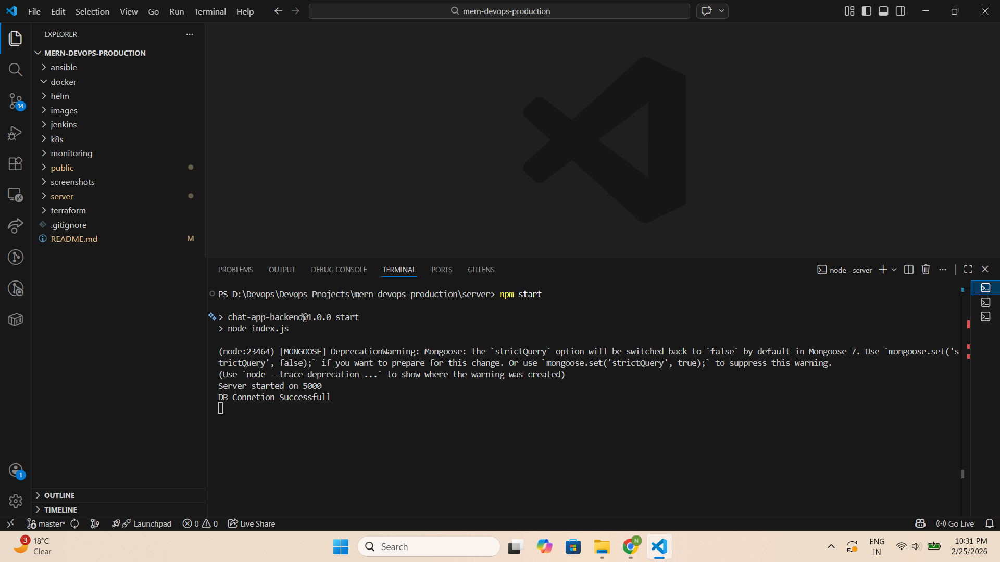
  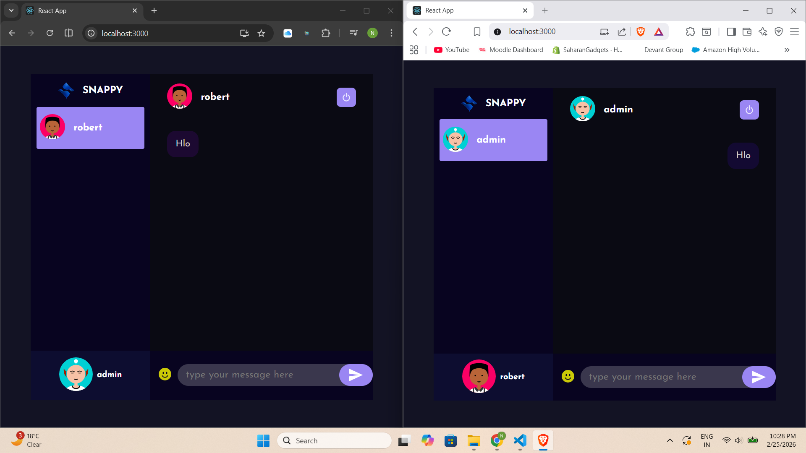
</p>

---

# ☁ Phase 2 – MongoDB Atlas Cloud Integration

## ✅ Objective
Migrate database from local MongoDB to MongoDB Atlas (cloud database).

## 🔧 Tasks Completed
- Created MongoDB Atlas cluster
- Created database user
- Configured connection string
- Allowed temporary network access (`0.0.0.0/0`)
- Updated backend `.env` with Atlas URI
- Verified cloud DB connectivity

## ✔ Result
- Atlas cluster connected successfully
- Database auto-created
- Users & Messages collections created
- Application working fully with cloud database

⚠ Security Note:  
Network access is temporarily set to `0.0.0.0/0`.  
This will be restricted to EC2 public IP in production.

---

## 📸 Proof of Execution

<p align="center">
  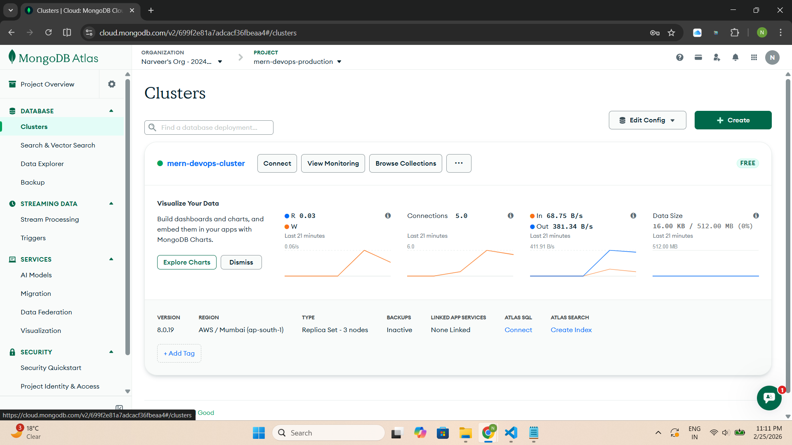
  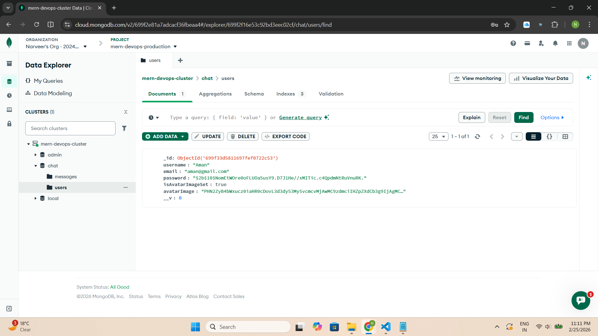
  <br />
  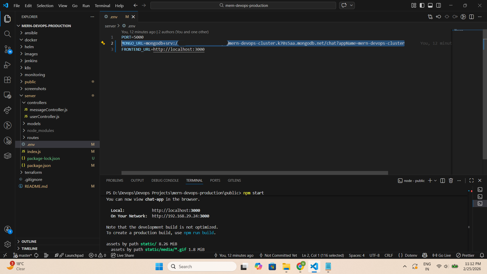
</p>

---

# 🐳 Phase 3 – Application Containerization (Docker)

## ✅ Objective
Containerize the MERN application to ensure:

- Environment consistency
- Portable deployments
- Production-grade builds
- Multi-container orchestration

---

## 🏗 Docker Architecture

Frontend (React Container)  
⬇  
Backend (Node.js Container)  
⬇  
MongoDB Atlas (Cloud Database)

Docker Compose manages:
- Multi-container setup
- Internal Docker networking
- Environment variable injection
- Port mapping

---

## 🔧 Tasks Completed

### 🔹 Backend Container
- Used official Node base image
- Set working directory
- Installed dependencies
- Injected environment variables
- Exposed backend port
- Started server with `npm start`

### 🔹 Frontend Container
- Used multi-stage build
- Installed dependencies
- Built optimized production build
- Served static React build

### 🔹 Docker Compose Setup
- Defined frontend & backend services
- Configured container names
- Set environment variables
- Mapped ports (3000 & 5000)
- Created shared Docker network

## ✔ Result
- Application runs entirely inside Docker containers
- Atlas DB connected successfully from container
- Containers communicate via Docker network
- Application accessible via browser

---

## 📸 Proof of Execution

<p align="center">
  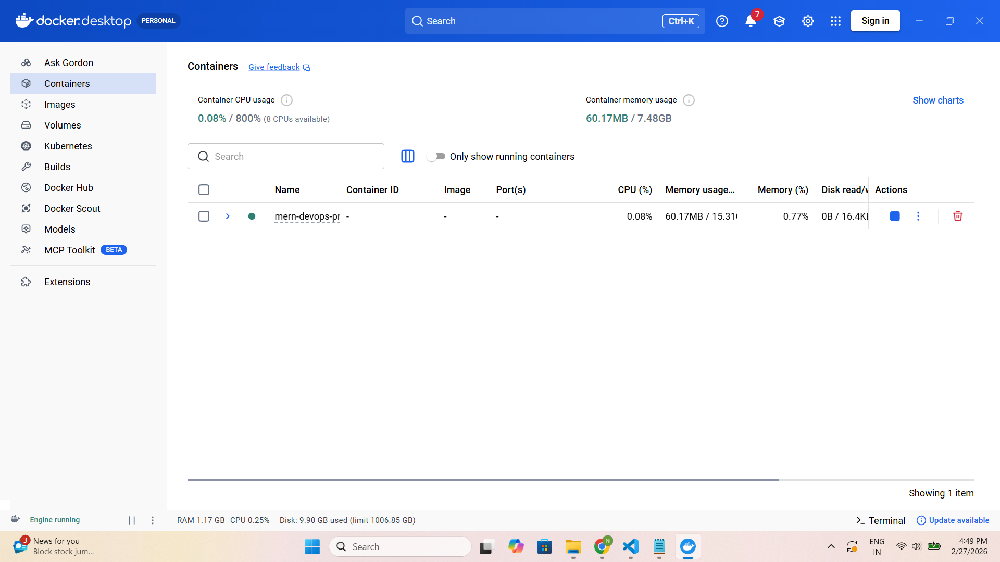
  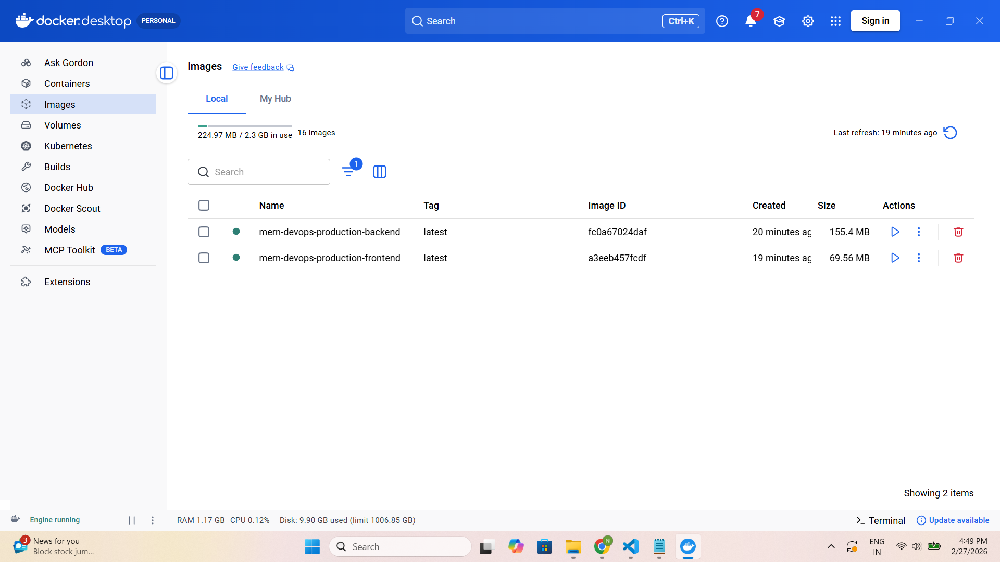
  <br />
  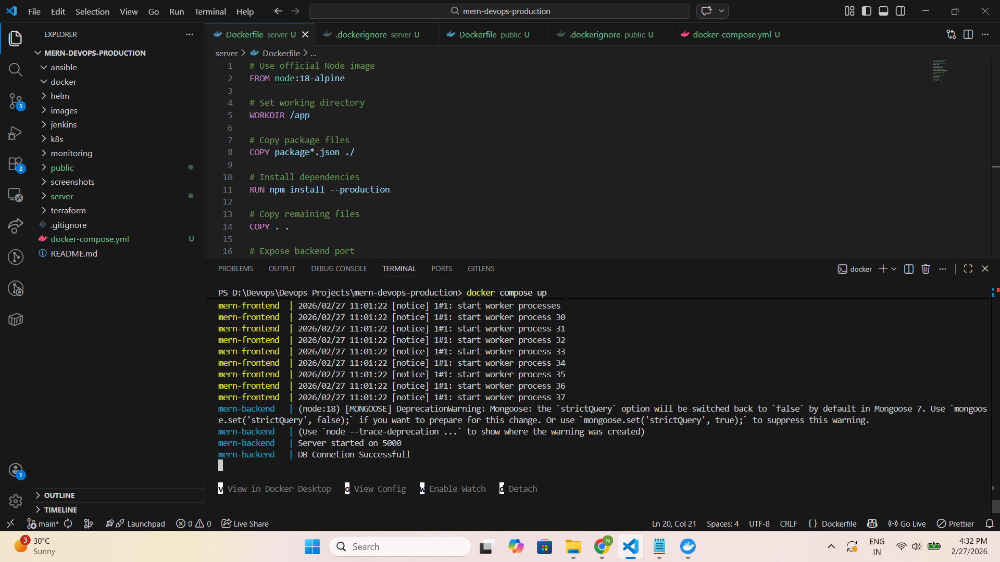
  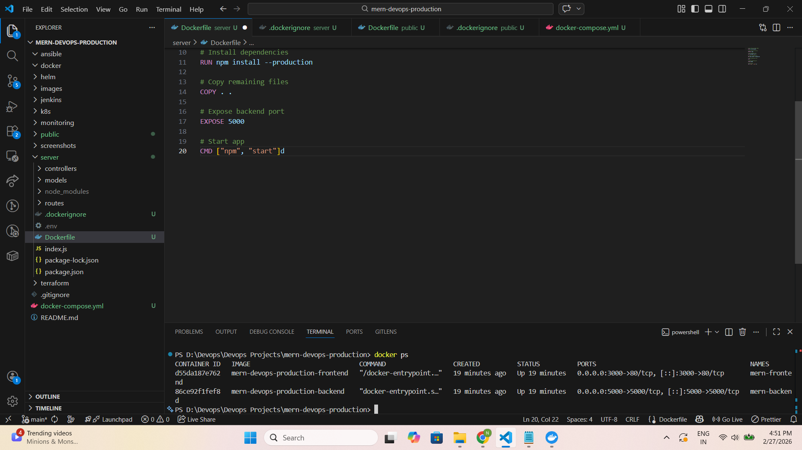
</p>

---

# ☁ Phase 4 – Infrastructure as Code (Terraform on AWS)

## ✅ Objective
Provision AWS cloud infrastructure using Infrastructure as Code (IaC) instead of manual AWS Console operations.

---

## 🏗 Infrastructure Provisioned

Using Terraform, the following resources were created:

- EC2 Instance (`t3.micro`)
- Custom Security Group
- SSH Key Pair
- Tagged AWS resources
- Output of public IP for remote access

Infrastructure is fully reproducible using version-controlled Terraform configuration files.

---

## 🔐 IAM & Security Approach

To follow least-privilege principles:

- Created dedicated IAM user (`terraform-user`)
- Attached:
  - `AmazonEC2FullAccess`
  - `IAMReadOnlyAccess`
- Avoided `AdministratorAccess`
- Configured AWS CLI inside WSL using restricted credentials
- No AWS secrets committed to repository

---

## 📁 Terraform Project Structure

```
terraform/
│
├── provider.tf
├── versions.tf
├── main.tf
├── variables.tf
├── outputs.tf
└── terraform.tfvars
```

---

## 🔧 Terraform Implementation Details

### 🔹 Provider Configuration
- AWS region: `ap-south-1`
- Credentials sourced securely from AWS CLI

### 🔹 EC2 Instance
- Ubuntu 22.04 LTS AMI
- Instance type: `t3.micro`
- SSH key pair attached
- Custom security group associated

### 🔹 Security Group Rules
- Port 22 (SSH)
- Port 80 (HTTP)
- Port 3000 (Frontend - temporary)
- Port 5000 (Backend - temporary)

⚠ Ports 3000 & 5000 will be removed in later phases and replaced with reverse proxy / Kubernetes Ingress.

---

## 🚀 Terraform Commands Executed

```
terraform init
terraform validate
terraform plan
terraform apply
```

---

## 🔎 Verification

- EC2 instance visible in AWS Console
- Public IP generated via Terraform output
- Successfully connected via SSH using private key
- Infrastructure fully provisioned using code

---

## ✔ Result

- Cloud infrastructure provisioned using IaC
- Manual AWS Console dependency eliminated
- Secure IAM practices implemented
- Infrastructure ready for configuration automation (Ansible)

---

## 📸 Proof of Execution

<p align="center">
  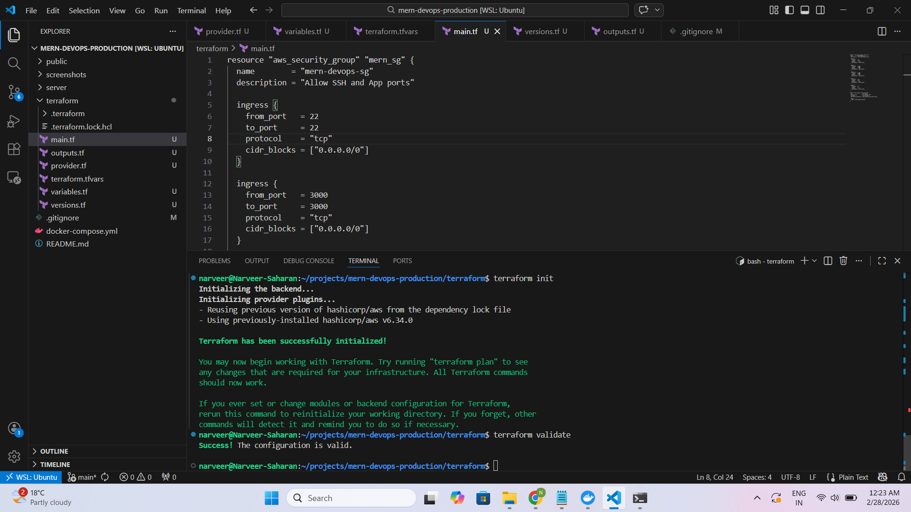
  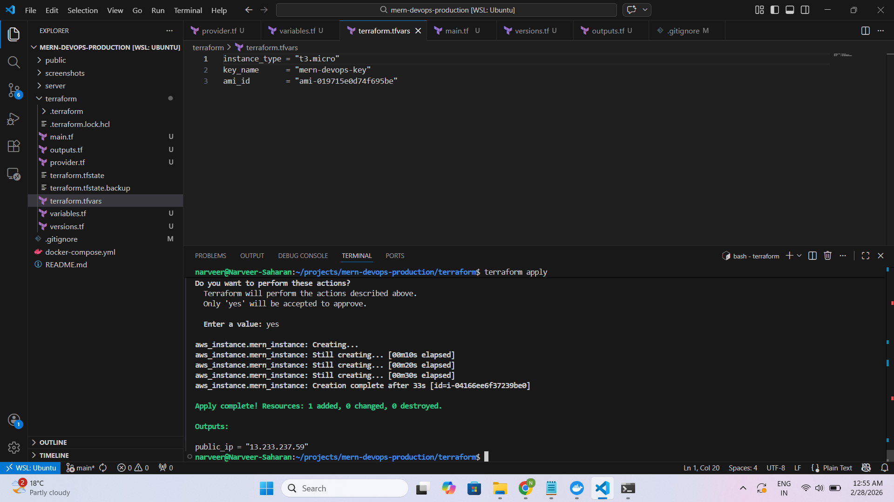
</p>

<p align="center">
  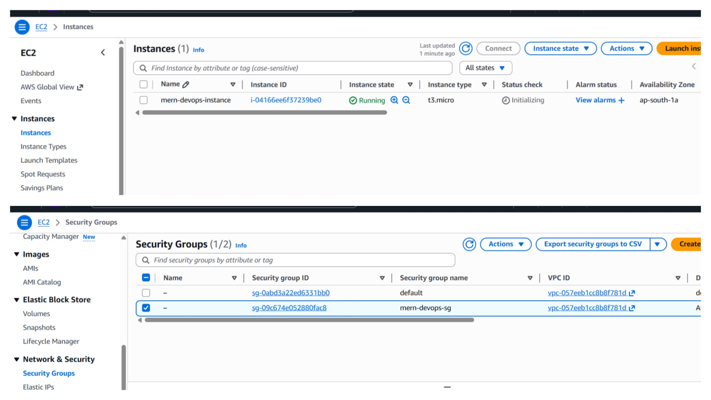
  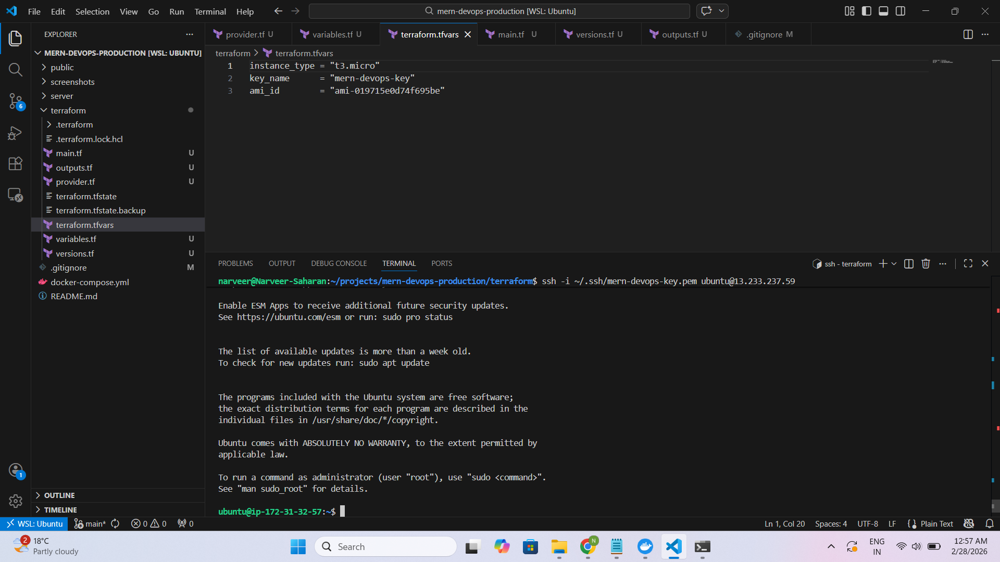
</p>

---

# 🤖 Phase 5 – Configuration Management & Automated Deployment (Ansible)

## ✅ Objective

Automate server configuration and application deployment using Ansible.

This phase eliminates manual SSH setup and enables one-command deployments.

---

## 🔧 Tasks Completed

### 🔹 Installed Docker Automatically
- Used Ansible playbook to install Docker
- Enabled Docker service
- Added ubuntu user to docker group
- Verified Docker without sudo

### 🔹 Automated Application Deployment
- Installed Docker Compose plugin
- Cloned GitHub repository
- Injected environment variables securely using `vars.yml`
- Ran `docker compose up -d --build`
- Verified running containers

### 🔹 Memory Optimization
- Configured 1GB swap memory on EC2 (`t3.micro`)
- Prevented container build failures due to low RAM

---

## 🔐 Secrets Management Improvement

Instead of hardcoding MongoDB Atlas URI in playbook:

- Created `vars.yml`
- Stored sensitive variables separately
- Prevented secrets from being committed to repository

This follows secure DevOps practices.

---

## 🚀 Deployment Command

```
ansible-playbook deploy-app.yml
```
Single command deployment achieved.

---

## ✔ Result

- EC2 fully configured automatically
- Docker installed and running
- MERN app deployed via containers
- Frontend accessible via public IP
- Backend health endpoint verified
- Fully automated cloud deployment pipeline

---

## 📸 Proof of Execution

<p align="center">
  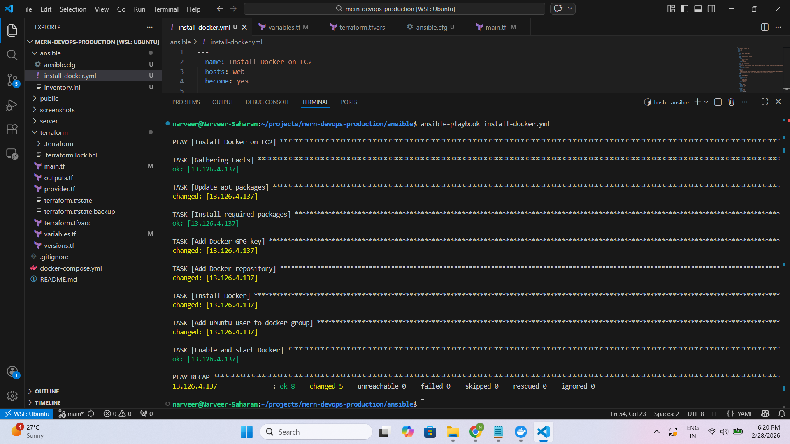
  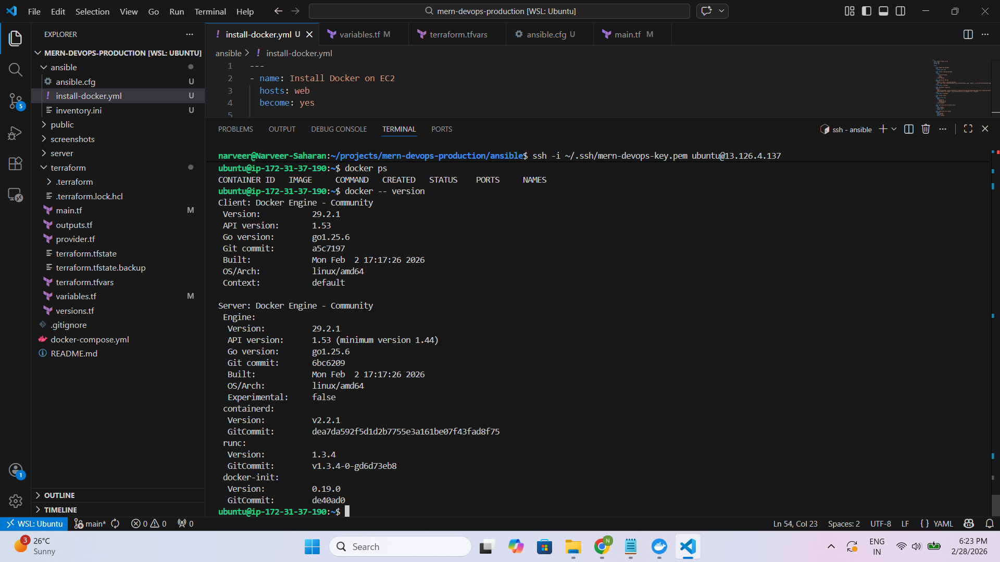
</p>

<p align="center">
  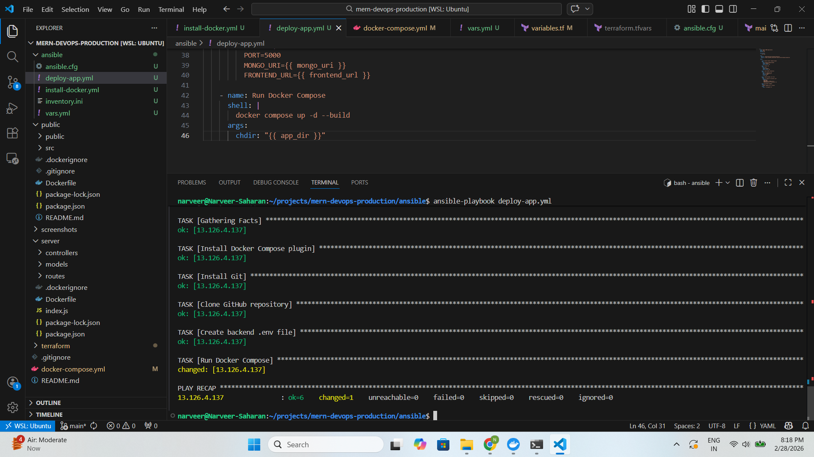
  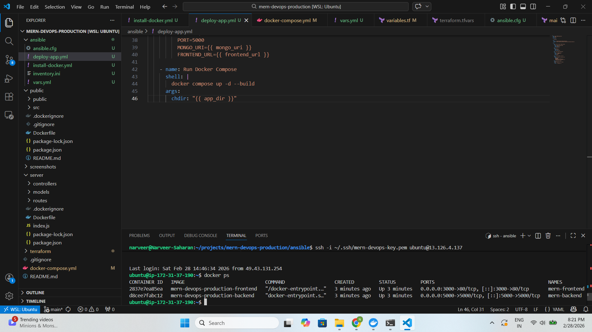
</p>

<p align="center">
  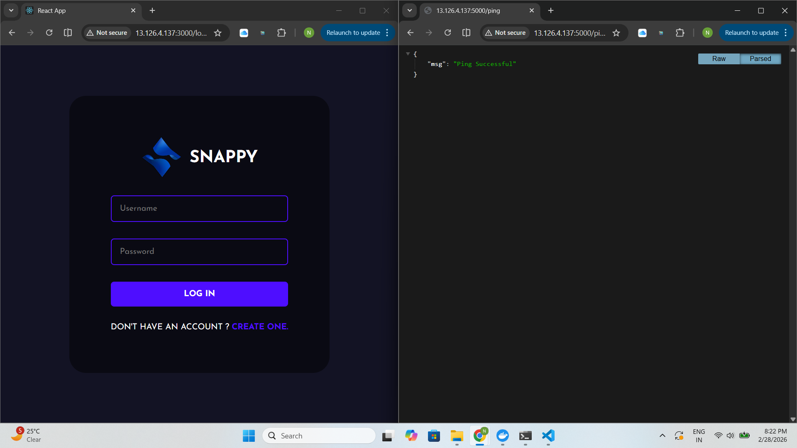
</p>

---

# ☸ Phase 6 – Kubernetes Deployment (K3s)

## ✅ Objective

Deploy the containerized MERN application on a Kubernetes cluster to achieve:

- Container orchestration  
- Self-healing workloads  
- Service discovery  
- Scalable deployments  
- Production-style networking using Ingress  

This phase transitions the project from Docker-based deployment to Kubernetes orchestration.

---

# 🏗 Kubernetes Architecture

Application components are deployed inside a **K3s single-node Kubernetes cluster** running on an AWS EC2 instance.

```
User
│
▼
Ingress (Traefik)
│
├── / → Frontend Service → Frontend Pod
│
└── /api → Backend Service → Backend Pod
│
▼
MongoDB Atlas
```

---

# 🧩 Kubernetes Components Used

| Component | Purpose |
|---------|---------|
| Namespace | Isolates project resources |
| Deployment | Manages pods and replicas |
| Service | Enables pod communication |
| Ingress | Routes external traffic |
| Secret | Stores sensitive data (Mongo URI) |

---

# 📂 Kubernetes Manifests

All Kubernetes configuration files are stored inside the project:
```
k8s/
│
├── namespace.yaml
├── secret.yaml
│
├── backend-deployment.yaml
├── backend-service.yaml
│
├── frontend-deployment.yaml
├── frontend-service.yaml
│
└── ingress.yaml.j2
```

Ingress is dynamically generated using **Ansible templating**.

---

# ⚙ Infrastructure Setup

Infrastructure is provisioned using **Terraform**.

AWS resources created:

| Resource | Configuration |
|--------|---------------|
| EC2 Instance | t3.small |
| Security Group | HTTP + SSH access |
| Region | ap-south-1 |

---

# 🤖 Automation with Ansible

Ansible is used to fully automate Kubernetes setup and deployment.

## Playbooks Used

| Playbook | Purpose |
|--------|---------|
| install-docker.yml | Installs Docker on EC2 |
| install-k3s.yml | Installs lightweight Kubernetes (K3s) |
| deploy-k8s.yml | Deploys application to cluster |

Automation includes:

- Installing Kubernetes
- Copying Kubernetes manifests
- Creating secrets
- Deploying pods and services
- Applying ingress configuration

---

# 🔐 Secrets Management

Sensitive information such as the MongoDB connection string is stored using **Kubernetes Secrets**.

Example workflow:
```
MongoDB URI
↓
Kubernetes Secret
↓
Backend Deployment
```

This prevents credentials from being exposed inside containers or Git repositories.

---

# 🌐 Ingress Configuration

The project uses **Traefik Ingress Controller** (default in K3s).

Traffic routing:

| Path | Service |
|-----|--------|
| / | Frontend |
| /api | Backend |
| /ping | Backend |

Ingress host uses dynamic DNS: ```<EC2_PUBLIC_IP>.nip.io```

---

# 📦 Deployed Kubernetes Resources

After deployment:
```
kubectl get pods -n mern
kubectl get svc -n mern
kubectl get ingress -n mern
```

Resources created:

| Resource | Count |
|--------|-------|
| Pods | 2 |
| Services | 2 |
| Ingress | 1 |
| Namespace | 1 |

---

## ✔ Result

The MERN application is now running inside a **Kubernetes cluster**.

Achievements:

- Containers orchestrated by Kubernetes
- Internal service communication enabled
- External access configured via Ingress
- Infrastructure fully automated with Terraform + Ansible
- Deployment reproducible and production-style

---

## 📸 Proof of Execution

<p align="center">
  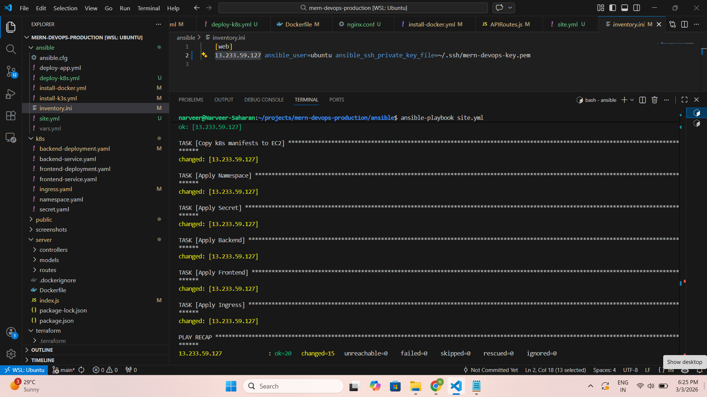
  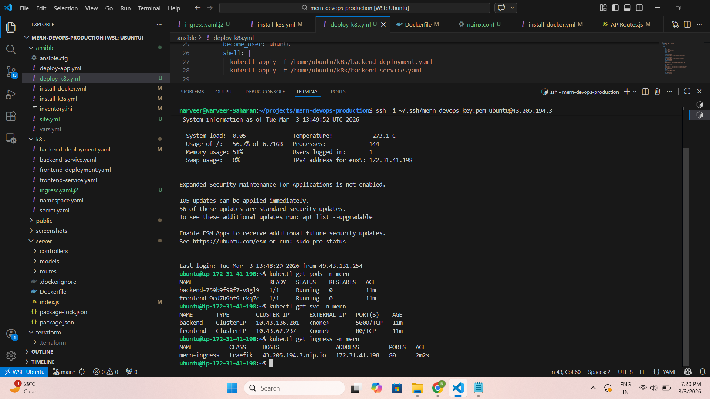
</p>

<p align="center">
  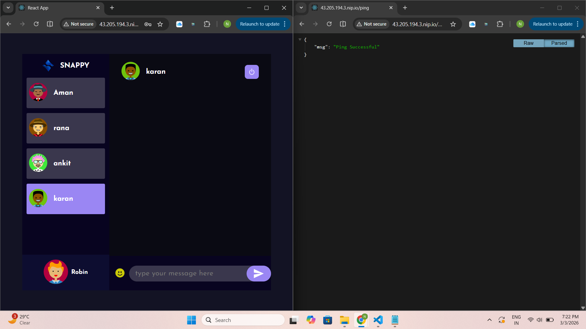
</p>

---

# 📂 Project Structure

```
mern-devops-production/
│
├── public/
├── server/
├── docker-compose.yml
│
├── terraform/
│ ├── provider.tf
│ ├── versions.tf
│ ├── main.tf
│ ├── variables.tf
│ ├── outputs.tf
│ └── terraform.tfvars
│
├── ansible/
│ ├── ansible.cfg
│ ├── install-docker.yml
│ ├── install-k3s.yml
│ ├── deploy-k8s.yml
│ ├── site.yml
│ └── vars.yml
│
├── k8s/
│ ├── namespace.yaml
│ ├── secret.yaml
│ ├── backend-deployment.yaml
│ ├── backend-service.yaml
│ ├── frontend-deployment.yaml
│ ├── frontend-service.yaml
│ └── ingress.yaml.j2
│
├── screenshots/
│ ├── phase-1/
│ ├── phase-2/
│ ├── phase-3/
│ ├── phase-4/
│ ├── phase-5/
│ └── phase-6/
│
└── README.md
```

---

# 🚀 Upcoming Phases

## 🔁 Phase 7 – CI/CD (Jenkins)
- Automated pipeline
- Docker image build & push
- Automated deployment to Kubernetes

## 📊 Phase 8 – Monitoring & Observability
- Prometheus metrics collection
- Grafana dashboards
- Node Exporter
- Container monitoring

---

# 🔐 Security Considerations

- MongoDB network access will be restricted in production
- Secrets will never be committed to repository
- AWS credentials managed securely
- Environment variables managed via secure methods
- Docker images optimized for minimal attack surface
- Infrastructure follows least-privilege IAM principles
- Future phases will implement production-grade ingress and TLS

---

# 🎯 Project Goal

This repository demonstrates:

- Production-grade configuration
- Cloud database integration
- Containerized architecture
- Infrastructure as Code implementation
- Configuration management automation
- Secure cloud provisioning
- Kubernetes deployment strategy
- CI/CD automation
- Monitoring & observability integration

---

# 📈 Architecture Evolution

Local Development  
⬇  
Cloud Database (MongoDB Atlas)  
⬇  
Containerized Application (Docker)  
⬇  
Cloud Infrastructure as Code (Terraform)  
⬇  
Configuration Management & Automated Deployment (Ansible)  
⬇  
(Next: Kubernetes Orchestration)
